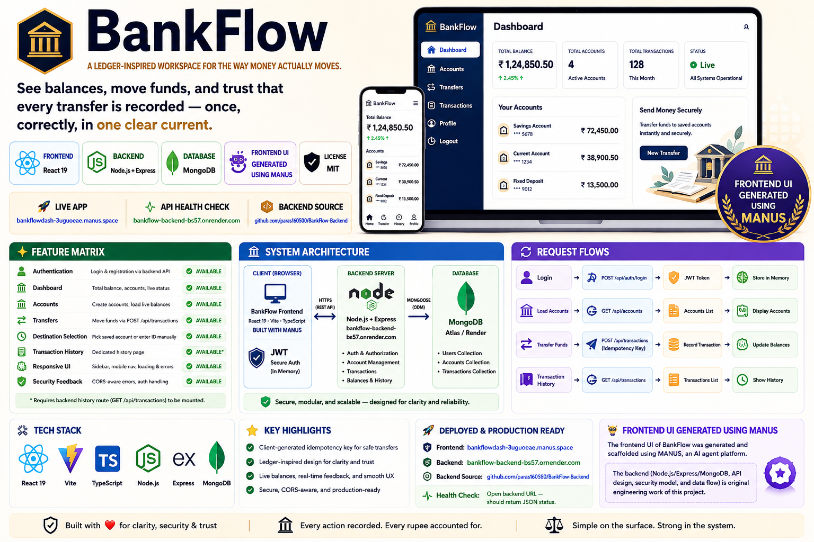
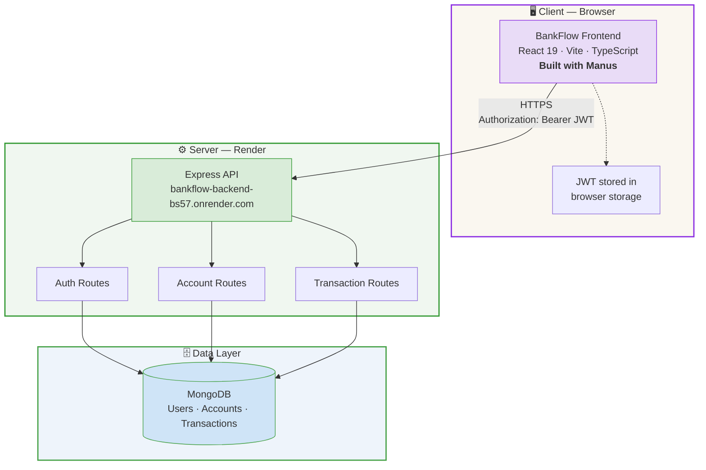
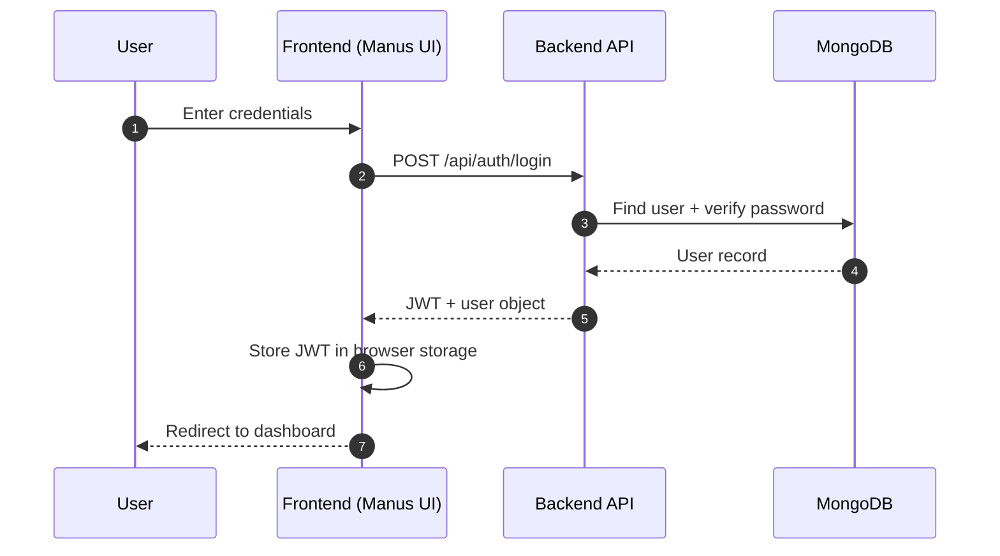
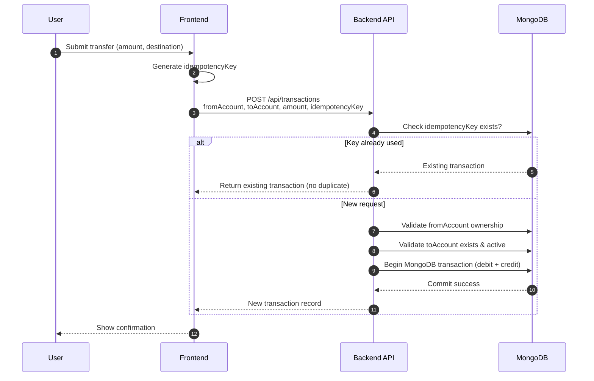
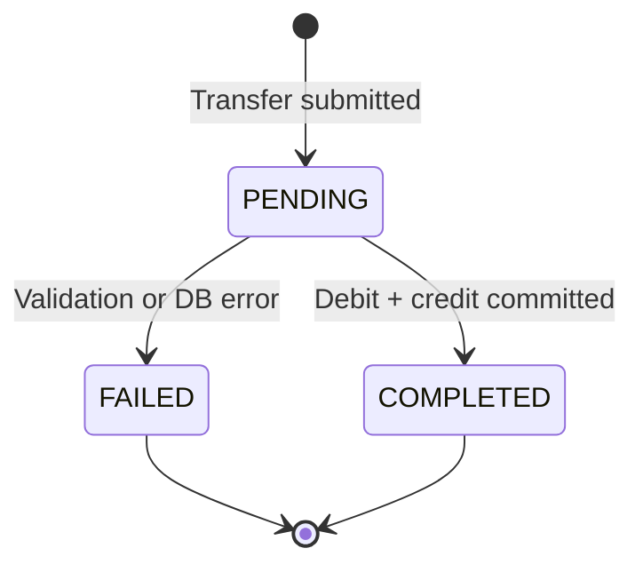
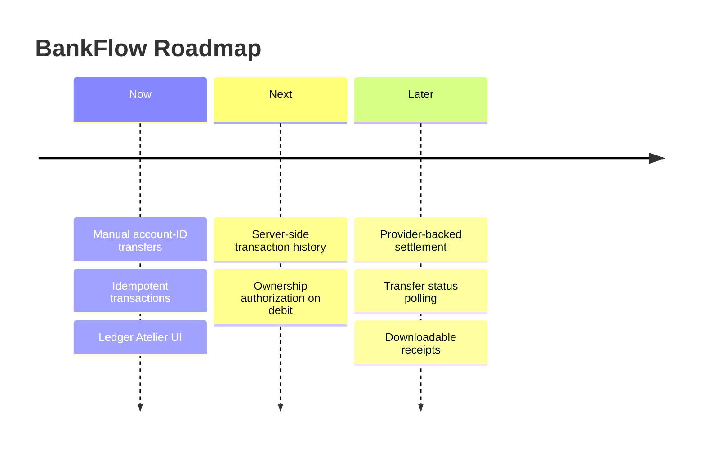

<div align="center">

# 🏦 BankFlow

### *A ledger-inspired workspace for the way money actually moves.*

See balances, move funds, and trust that every transfer is recorded — once, correctly, in one clear current.

<br/>

[](https://bankflowdash-3uguoeae.manus.space)
[](https://bankflow-backend-bs57.onrender.com/)
[](#-system-architecture)
[](https://manus.im)
[](#-license)

**[🚀 Live App](https://bankflowdash-3uguoeae.manus.space) &nbsp;·&nbsp; [🩺 API Health Check](https://bankflow-backend-bs57.onrender.com/) &nbsp;·&nbsp; [📦 Backend Source](https://github.com/paras160500/BankFlow-Backend)**

</div>

<br/>



> ### 🧵 Attribution
> The **frontend UI** for BankFlow (`bankflowdash-3uguoeae.manus.space`) was generated and scaffolded using **[Manus](https://manus.im)**, an AI agent platform — it is not hand-built original design work. The **backend** (Node.js/Express/MongoDB, API design, security model, and data flow) is the original engineering work of this project. Please keep this distinction in mind when evaluating or reusing this repository.

<br/>

## 📚 Table of Contents

- [Why BankFlow](#-why-bankflow)
- [Live Deployment](#-live-deployment)
- [Feature Matrix](#-feature-matrix)
- [System Architecture](#-system-architecture)
- [Request Flows](#-request-flows)
- [API Contract](#-api-contract)
- [Local Development](#-local-development)
- [Deploying the Frontend](#-deploying-the-frontend-render--static-site)
- [Backend CORS Configuration](#-backend-cors-configuration)
- [Deployment Checklist](#-backend-deployment-checklist)
- [Troubleshooting](#-troubleshooting)
- [Security Notes](#-security-notes)
- [Project Structure](#-project-structure)
- [Design Direction](#-design-direction--ledger-atelier)
- [Roadmap](#-roadmap)
- [License](#-license)

<br/>

---

## ✨ Why BankFlow

Most finance UIs bury the important stuff behind noise. BankFlow does the opposite: it's built around one rule — **every financial action should be visible, deliberate, and easy to verify.**

That shows up in small, deliberate choices:

- 🔐 Every transfer carries a **client-generated idempotency key**, so a nervous double-click never becomes a duplicate transaction.
- 📖 The interface reads like a **well-kept ledger** — warm paper surfaces, ink-dark panels, serif type — not a generic admin dashboard.
- 🧭 Destinations are chosen from **known accounts**, not typed blindly into a black box.

<br/>

## 🚀 Live Deployment

| Layer | URL | Origin | Responsibility |
|:--|:--|:--:|:--|
| 🖥️ **Frontend** | [`bankflowdash-3uguoeae.manus.space`](https://bankflowdash-3uguoeae.manus.space) | 🟣 Built with Manus | Auth UI, dashboard, accounts, transfers, transaction history |
| ⚙️ **Backend** | [`bankflow-backend-bs57.onrender.com`](https://bankflow-backend-bs57.onrender.com/) | 🟢 Custom-built | Auth, account operations, balances, transaction APIs |
| 📦 **Backend Repo** | [`github.com/paras160500/BankFlow-Backend`](https://github.com/paras160500/BankFlow-Backend) | 🟢 Custom-built | Server, controllers, models, and routes |

> 💡 **Health check:** open the backend URL directly — the root endpoint should return a JSON payload confirming the service is awake. Render free-tier instances cold-start, so the first request may take a few seconds.

<br/>

## 🧩 Feature Matrix

| Area | Capability | Status |
|:--|:--|:--:|
| 🔑 Authentication | Login & registration via backend API | ✅ Available |
| 📊 Dashboard | Total balance, account snapshots, live status, refresh controls | ✅ Available |
| 🏛️ Accounts | Create accounts, load live balances | ✅ Available |
| 💸 Transfers | Move funds via `POST /api/transactions` | ✅ Available |
| 🎯 Destination selection | Pick a saved account or enter an ID manually | ✅ Available |
| 🧾 Transaction history | Dedicated history page | ✅ Available* |
| 📱 Responsive UI | Sidebar, mobile nav, loading & empty states, error feedback | ✅ Available |
| 🛡️ Security feedback | CORS-aware errors, authenticated request handling | ✅ Available |

<sub>* Requires the backend history route (`GET /api/transactions`) to be mounted.</sub>

<br/>

## 🏗️ System Architecture



<br/>

## 🔄 Request Flows

### Authentication



### Money transfer (with idempotency)



### Transaction status lifecycle



<br/>

## 📡 API Contract

All routes are mounted under `/api`.

| Method | Route | Auth | Purpose |
|:--:|:--|:--:|:--|
| `POST` | `/api/auth/login` | 🔓 Public | Authenticate an existing user |
| `POST` | `/api/auth/register` | 🔓 Public | Create a new user account |
| `POST` | `/api/auth/logout` | 🔒 Auth | End the current session (if supported) |
| `GET` | `/api/accounts` | 🔒 Auth | Load the current user's accounts |
| `POST` | `/api/accounts` | 🔒 Auth | Create a new account |
| `GET` | `/api/accounts/:accountId/balance` | 🔒 Auth | Load an account's current balance |
| `POST` | `/api/transactions` | 🔒 Auth | Create a transaction between two account IDs |
| `GET` | `/api/transactions` | 🔒 Auth | Load the current user's transaction history |

### Transfer request

```http
POST /api/transactions
Authorization: Bearer YOUR_JWT_TOKEN
Content-Type: application/json
```

```json
{
  "fromAccount": "SOURCE_ACCOUNT_ID",
  "toAccount": "DESTINATION_ACCOUNT_ID",
  "amount": 2500,
  "idempotencyKey": "unique-client-generated-key"
}
```

> ⚠️ **Important:** `toAccount` must be an existing BankFlow account ID — the controller resolves it with `accountModel.findOne()`. Arbitrary external bank-account numbers are not accepted by the current implementation.

### Transaction history response

The frontend accepts account references as either plain IDs or populated objects:

```json
{
  "success": true,
  "count": 1,
  "transactions": [
    {
      "_id": "TRANSACTION_ID",
      "fromAccount": { "_id": "SOURCE_ACCOUNT_ID" },
      "toAccount": { "_id": "DESTINATION_ACCOUNT_ID" },
      "amount": 2500,
      "status": "COMPLETED",
      "idempotencyKey": "unique-client-generated-key",
      "createdAt": "2026-08-15T10:30:00.000Z"
    }
  ]
}
```

<br/>

## 🛠️ Local Development

### Requirements

| Tool | Version |
|:--|:--|
| Node.js | `20+` |
| pnpm | `10+` |
| Browser | Latest Chrome, Edge, Firefox, or Safari |

### Setup

```bash
git clone <your-frontend-repository-url>
cd bankflow-frontend
pnpm install
pnpm dev
```

The dev server prints a local URL and points at the deployed backend by default:

```
https://bankflow-backend-bs57.onrender.com/
```

### Validate before shipping

```bash
pnpm check   # TypeScript validation
pnpm build   # Production bundle + deployability check
```

<br/>

## ☁️ Deploying the Frontend (Render — Static Site)

| Setting | Value |
|:--|:--|
| **Build command** | `pnpm install --frozen-lockfile && pnpm build` |
| **Publish directory** | `dist/public` |
| **Environment** | Node.js / pnpm |
| **Rewrite rule** | `/*` → `/index.html` (status `200`) |

> The rewrite rule matters — BankFlow uses client-side routing, and without it, refreshing a dashboard route returns a 404 from the static host.

<br/>

## 🔐 Backend CORS Configuration

The deployed frontend origin must be allow-listed **exactly**, with no trailing slash:

```
https://bankflowdash-3uguoeae.manus.space
```

```js
const cors = require("cors");

const allowedOrigins = new Set([
  "http://localhost:5173",
  "http://localhost:3000",
  "https://bankflowdash-3uguoeae.manus.space",
]);

const corsOptions = {
  origin(origin, callback) {
    if (!origin || allowedOrigins.has(origin)) {
      return callback(null, true);
    }
    console.log("Blocked CORS origin:", origin);
    return callback(new Error(`CORS blocked origin: ${origin}`));
  },
  credentials: false,
  methods: ["GET", "POST", "PATCH", "DELETE", "OPTIONS"],
  allowedHeaders: ["Content-Type", "Authorization"],
};

app.use(cors(corsOptions));
app.options("*", cors(corsOptions));
```

> Redeploy the backend after changing CORS — updating source alone won't affect the live Render service.

<br/>

## ✅ Backend Deployment Checklist

- [ ] Root endpoint returns a successful JSON response
- [ ] `Access-Control-Allow-Origin` matches the frontend domain exactly
- [ ] `OPTIONS` preflight requests succeed for protected routes
- [ ] `Authorization` is included in `allowedHeaders`
- [ ] MongoDB connection is live in the Render environment
- [ ] Login / registration return a usable JWT + user object
- [ ] `POST /api/transactions` accepts `fromAccount`, `toAccount`, `amount`, `idempotencyKey`
- [ ] `GET /api/transactions` is exported, mounted, and auth-protected

<br/>

## 🩹 Troubleshooting

<details>
<summary><strong>"Failed to fetch"</strong></summary>

<br/>

Open the backend root URL directly to confirm the service is awake. Confirm the backend was redeployed with the exact frontend origin, and that CORS middleware is registered **before** the API routers. Render cold starts can delay the first request — retry after a few seconds.

</details>

<details>
<summary><strong>"CORS blocked origin"</strong></summary>

<br/>

Check the Render backend logs — the rejected origin is logged. Copy it exactly (no added or missing trailing slash) into `allowedOrigins`, then redeploy.

</details>

<details>
<summary><strong>Login succeeds but the dashboard is empty</strong></summary>

<br/>

Confirm the login response includes a JWT, that authenticated requests accept the same Bearer token, and that the logged-in user actually has at least one account tied to their user ID.

</details>

<details>
<summary><strong>Transfer fails with "From/To Account is not valid"</strong></summary>

<br/>

The controller expects both IDs to exist in the `account` collection — the destination field takes an account ID, not a raw bank-account number. Confirm the account is an active BankFlow account.

</details>

<details>
<summary><strong>The Transactions page is empty</strong></summary>

<br/>

Confirm `GET /api/transactions` exists, is exported from the controller, mounted on the router, and protected by the same auth middleware as the other transaction routes.

</details>

<details>
<summary><strong>A transfer appears twice</strong></summary>

<br/>

Always send a unique `idempotencyKey` per intended transfer. Retrying with the same key should return the existing transaction rather than create a new one.

</details>

<br/>

## 🛡️ Security Notes

BankFlow handles financial data — treat it accordingly:

- Use **HTTPS everywhere**; never commit secrets to source control.
- Keep JWT signing secrets, MongoDB credentials, and Render environment variables **out of the frontend bundle**.
- The backend must authorize the source account against the authenticated user **before** debiting it.
- Validate that the destination account is active and that the amount is a **positive finite number**.
- Enforce idempotency and wrap debit/credit ledger writes in a **MongoDB transaction**.

> ⚠️ The manual account-ID transfer flow moves funds **between BankFlow accounts only**. It should not be described as a real external-bank transfer unless a licensed banking/payment provider is integrated with settlement confirmation.

<br/>

## 📁 Project Structure

```
bankflow-frontend/                 🟣 UI generated via Manus
├── client/
│   ├── public/
│   └── src/
│       ├── components/     # Reusable UI + shadcn primitives
│       ├── contexts/       # Theme & app-level contexts
│       ├── lib/
│       │   └── api.ts      # Backend URL, auth, account, balance & transaction calls
│       ├── pages/
│       │   └── Home.tsx    # Auth screen + dashboard experience
│       ├── App.tsx         # App shell & routing
│       └── index.css       # "Ledger Atelier" design system
├── server/                 # Static-template compatibility server
├── package.json
├── vite.config.ts
└── README.md

bankflow-backend/                  🟢 Custom-built API
├── controllers/
├── models/
├── routes/
├── middleware/
└── server.js
```

<br/>

## 🎨 Design Direction — *Ledger Atelier*

An editorial finance interface inspired by annual reports, account books, and well-made stationery:

> warm paper surfaces · ink-dark panels · restrained chartreuse accents · ruled separators · serif display type · deliberate spacing

Data stays quiet and legible; hierarchy stays expressive. Primary actions carry the signature chartreuse accent — everything else gets out of the way.

<sub>🟣 This visual system was scaffolded through Manus and refined for BankFlow's ledger aesthetic.</sub>

<br/>

## 🗺️ Roadmap



<br/>

## 📄 License

Released under the **MIT License**, unless the backend repository specifies otherwise — check there before redistributing the complete system.

<br/>

## 🔗 References

- [BankFlow Backend Repository](https://github.com/paras160500/BankFlow-Backend)
- [BankFlow — Live Frontend](https://bankflowdash-3uguoeae.manus.space) <sub>(built with Manus)</sub>
- [BankFlow — Live Backend](https://bankflow-backend-bs57.onrender.com/)

---

<div align="center">
<sub>Backend engineered from scratch · Frontend UI scaffolded with <a href="https://manus.im">Manus</a> · Built with care for the numbers that matter 🏦</sub>
</div>
